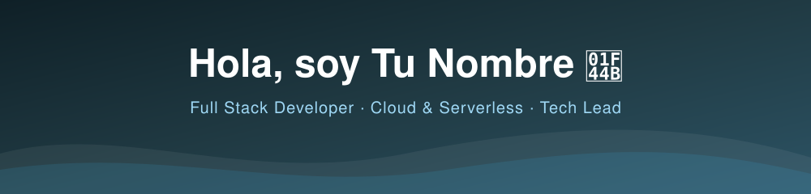
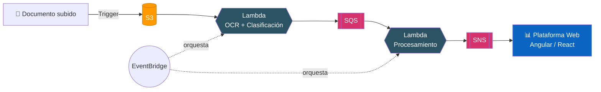

<!-- ============================================================
  README DE PERFIL DE GITHUB
  1. Crea un repositorio PÚBLICO con el mismo nombre que tu usuario
  2. Marca "Add a README"
  3. Pega este contenido y sube también header.svg y footer.svg al repo; edita "Tu Nombre" dentro de header.svg; reemplaza TU-USUARIO (stats), y los [CORCHETES] de contacto
============================================================ -->

<div align="center">



<a href="https://git.io/typing-svg">
  
</a>

<br/>


</div>

---

## 👨‍💻 Sobre mí

Desarrollador **full stack** con más de **11 años de experiencia** liderando equipos y entregando productos **móviles y web** para clientes corporativos y proyectos internos.

Mi enfoque es simple: **convertir requisitos en productos operativos**, reduciendo tiempos de despliegue y elevando la calidad mediante **automatización e integración continua**.

```text
🔭 Ahora trabajo en     →  Spring Boot + Angular on-premise (TRC)  ·  Django + Angular + ML (Medical Data)
🌱 Liderando            →  Plataforma de facturación electrónica con la DGII (Rep. Dominicana)
☁️ Especialidad         →  Serverless en AWS · Microservicios · CI/CD
🧠 Me apasiona          →  OCR, Computer Vision y automatización de procesos
🎯 Filosofía            →  Si se repite más de dos veces, se automatiza
```

---

## 🛠️ Stack tecnológico

<div align="center">

**Lenguajes**


**Frontend & Mobile**


**Backend & APIs**


**Cloud & DevOps**


**Diseño & Gestión**


</div>

<details>
<summary><b>📋 Ver detalle completo por categoría</b></summary>
<br/>

| Categoría | Tecnologías |
|:--|:--|
| **Lenguajes** | Python · JavaScript · TypeScript · Node.js |
| **Frontend** | Angular · React · Ionic · Microfrontends · PrimeNG |
| **Backend & APIs** | Django REST · Spring Boot · Express · RESTful APIs |
| **AWS** | Lambda · EC2 · S3 · Elastic Beanstalk · Amplify · CloudFormation · Serverless Framework |
| **Mensajería** | SQS · SNS · ActiveMQ · EventBridge |
| **CI/CD & Repos** | Bitbucket Pipelines · Jenkins · Git · OpenShift |
| **Data & ML Ops** | OCR · Computer Vision (firmas y rostros) · Web Scraping · Machine Learning |
| **Contenedores** | Docker · Kubernetes · VPS · Monitoreo y logging |
| **Metodologías** | Agile · Liderazgo de equipos · Diseño con Figma · Pruebas automatizadas |

</details>

---

## ☁️ Arquitectura que me gusta construir

Un ejemplo del tipo de pipeline serverless que he llevado a producción para procesamiento documental:



---

## 📈 Resultados que hablan

<div align="center">

| 🚀 Impacto | 📌 Dónde |
|:--:|:--|
| **−80%** en tiempo de procesamiento | Automatización de ingesta documental con OCR (Tooles) |
| **15,000+** documentos digitalizados y categorizados | Pipeline OCR sobre AWS Lambda para CorTolima |
| **−20%** en tiempo de desarrollo front | Librería de componentes reutilizables (NXS / Carvajal) |
| **−50%** en tiempo de respuesta a QA | Mejora de procesos de entrega (NXS) |
| **500+** usuarios alcanzados | Modernización de plataformas y visión artificial |

</div>

---

## 💼 Trayectoria profesional

```text
2026 ─ hoy   ▸ TRC ·················· Full Stack (Spring Boot, Angular, Jenkins, OpenShift)
2025 ─ hoy   ▸ Medical Data ········· Líder de APIs hospitalarias (Django) + Angular + ML
2024 ─ 2025  ▸ NXS Oficial ·········· Microfrontends Angular, Ionic, Spring Boot, ActiveMQ/SQS
2023 ─ 2024  ▸ Tooles ··············· OCR + Serverless AWS (Lambda, SQS, SNS, EventBridge)
2021 ─ 2023  ▸ FabioArias ··········· Migración a AWS, CI/CD, detección de firmas y rostros
2020 ─ 2025  ▸ geww media & tech ···· Líder técnico · Migración GCP → AWS (Finky)
2009 ─ 2025  ▸ Freelance ············ Soluciones web y móviles end-to-end
2015 ─ 2021  ▸ Iglesia de Dios ······ Project Manager de proyectos tecnológicos
2014 ─ 2015  ▸ Dynamic Consultants ·· Consultor técnico (módulos financieros y BI con QlikView)
```

<details>
<summary><b>⭐ Proyectos destacados</b></summary>
<br/>

- 🏛️ **Plataforma para ministerio:** microcomponentes en Spring Boot y vistas en Angular, despliegue con Git + Jenkins + OpenShift (100% on-premise).
- 🏥 **Plataforma hospitalaria:** APIs en Django, front en Angular y flujos acelerados con machine learning.
- 🧾 **Facturación electrónica DGII:** liderazgo técnico del proyecto de facturación para República Dominicana.
- 📱 **Sindispetrol (Ecopetrol):** app móvil Android/iOS con Ionic + Angular y portal administrativo. *Rol: líder técnico.*
- 🔁 **Migración Finky:** migración completa de GCP a AWS (APIs, front y despliegues en EC2/Elastic Beanstalk).
- 🛒 **E-commerce Jireth:** tienda online completa, de catálogo a gestión de pedidos.
- 🩺 **App de telemedicina:** aplicación móvil con backend en Python para gestión de información clínica.
- ✍️ **Visión artificial:** detección de firmas y rostros desplegada en Lambdas.

</details>

---

## 📊 Estadísticas de GitHub
<div align="center">   </div>


---

## 🤝 Hablemos

<div align="center">

[](https://www.linkedin.com/in/[TU-LINKEDIN])
[](mailto:[TU-CORREO])
[]([TU-WEB])

<br/>

*💬 Pregúntame sobre: arquitecturas serverless en AWS, migraciones a la nube, CI/CD, microfrontends con Angular o cómo llevar OCR a producción.*


</div>
